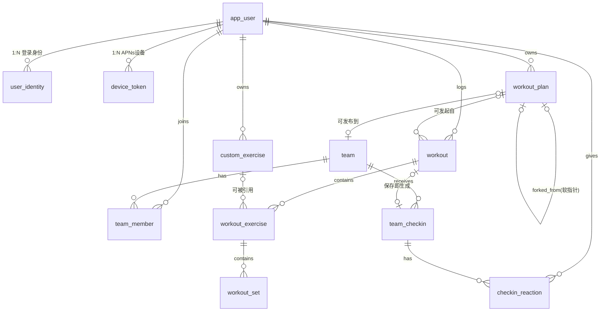

## 数据模型（ER + DDL 草案）

本文件把 `design.md` 的架构决策落成可建表的 schema，是 Flyway 基线迁移（`V1__baseline.sql`）的设计稿。目标库 PostgreSQL 16。

### 约定（贯穿全库）

1. **主键 UUID v7**：所有表主键 `id uuid`，由应用层生成（同步实体由 iOS 客户端离线预生成，使 `localId == serverId`；服务端权威实体由后端生成）。PostgreSQL 16 无原生 `uuidv7()`，故列不设 DB 默认值，一律由应用写入；`gen_random_uuid()` 仅作兜底。
2. **同步信封**：参与「离线优先 + 云同步」的聚合根表统一携带以下列（下文简称「同步信封」）：
   - `created_at timestamptz NOT NULL`
   - `updated_at timestamptz NOT NULL` —— last-write-wins 的比较基准（D3）
   - `deleted_at timestamptz NULL` —— 软删除墓碑，同步时下发让多设备一致
   - `version int NOT NULL DEFAULT 0` —— 乐观锁（MyBatis-Plus `@Version`），每次写 +1
3. **逻辑删除**：所有查询默认 `WHERE deleted_at IS NULL`（MyBatis-Plus `@TableLogic` 映射到 `deleted_at`）。
4. **枚举**：用 `text + CHECK` 而非原生 enum，便于演进。
5. **Team 域为服务端权威**（D2）：`team*` 不带 `localId/syncStatus`，走 APNs + 进页面拉取；仍用 UUID v7 主键、写操作仍走幂等键（D4）。
6. **内置目录不入库**：150-200 内置动作随 App 包发布（只读 seed），**不建数据库表**。训练记录通过 `builtin_exercise_code`（稳定字符串码）引用，并**快照名称**到记录行，保证服务端与队友端无需内置目录即可展示。

### 全局 ER 图



软指针（`forked_from`、`plan_id`、`workout_id`）**不设外键约束**，使原对象删除不级联破坏副本/历史（满足 team-sharing 「原模板删除不影响 Fork 副本」与训练历史独立留存）。

---

## 1. 账户与同步域（account-sync）

```sql
-- 业务主体；Apple sub 绝不作主键（D1）
CREATE TABLE app_user (
    id                 uuid PRIMARY KEY,
    display_name       text,
    first_login_email  text,                 -- 首登邮箱持久化，用于账号恢复线索
    created_at         timestamptz NOT NULL,
    updated_at         timestamptz NOT NULL,
    deleted_at         timestamptz,
    version            int NOT NULL DEFAULT 0
);

-- 身份三层模型：一个 user 可挂多种登录方式
CREATE TABLE user_identity (
    id                uuid PRIMARY KEY,
    user_id           uuid NOT NULL REFERENCES app_user(id),
    provider          text NOT NULL CHECK (provider IN ('apple')),  -- 预留 phone/wechat
    provider_user_id  text NOT NULL,         -- Apple sub
    email             text,
    created_at        timestamptz NOT NULL,
    updated_at        timestamptz NOT NULL,
    CONSTRAINT uq_identity_provider UNIQUE (provider, provider_user_id)
);
CREATE INDEX idx_identity_user ON user_identity(user_id);

-- 幂等键：所有写接口的 Idempotency-Key → 首次结果映射（D4）
CREATE TABLE idempotency_key (
    id               uuid PRIMARY KEY,
    user_id          uuid NOT NULL REFERENCES app_user(id),
    idem_key         text NOT NULL,          -- 客户端用 localId 派生
    request_hash     text,                   -- 同键异体检测
    response_status  int,
    response_body    jsonb,
    created_at       timestamptz NOT NULL,
    CONSTRAINT uq_idem UNIQUE (user_id, idem_key)
);

-- APNs 设备 token（D6）
CREATE TABLE device_token (
    id           uuid PRIMARY KEY,
    user_id      uuid NOT NULL REFERENCES app_user(id),
    apns_token   text NOT NULL,
    environment  text NOT NULL CHECK (environment IN ('sandbox','production')),
    created_at   timestamptz NOT NULL,
    updated_at   timestamptz NOT NULL,
    CONSTRAINT uq_apns_token UNIQUE (apns_token)
);
CREATE INDEX idx_device_user ON device_token(user_id);
```

---

## 2. 训练域（workout-tracking）

存储分界（D5）：计划=jsonb 文档；记录=规范化三层（workout → workout_exercise → workout_set）。`workout_*` 子表冗余 `user_id` 以便 PR/曲线按用户直查，免 join。

```sql
-- 用户自定义动作（内置动作不入库）
CREATE TABLE custom_exercise (
    id              uuid PRIMARY KEY,
    user_id         uuid NOT NULL REFERENCES app_user(id),
    name            text NOT NULL,
    primary_muscle  text NOT NULL,
    equipment_type  text,
    created_at      timestamptz NOT NULL,
    updated_at      timestamptz NOT NULL,
    deleted_at      timestamptz,
    version         int NOT NULL DEFAULT 0
);
CREATE INDEX idx_custom_ex_user ON custom_exercise(user_id) WHERE deleted_at IS NULL;

-- 单次训练计划模板；items 为有序动作列表，每项含稳定 itemId（D5/spec）
-- items jsonb 形如：
-- [{"itemId":"uuid","exerciseRef":"builtin:bench_press"|"custom:<uuid>",
--   "order":1,"suggestedSets":4,"suggestedReps":8,"suggestedWeight":60.0}]
CREATE TABLE workout_plan (
    id               uuid PRIMARY KEY,
    user_id          uuid NOT NULL REFERENCES app_user(id),
    name             text NOT NULL,
    items            jsonb NOT NULL DEFAULT '[]'::jsonb,
    forked_from      uuid,                   -- 软指针，无 FK
    shared_to_team_id uuid,                  -- 非空=已发布到该 Team（软指针，无 FK）
    created_at       timestamptz NOT NULL,
    updated_at       timestamptz NOT NULL,
    deleted_at       timestamptz,
    version          int NOT NULL DEFAULT 0
);
CREATE INDEX idx_plan_user ON workout_plan(user_id) WHERE deleted_at IS NULL;
CREATE INDEX idx_plan_team ON workout_plan(shared_to_team_id) WHERE shared_to_team_id IS NOT NULL;

-- 一次训练（聚合根，带同步信封）
CREATE TABLE workout (
    id          uuid PRIMARY KEY,
    user_id     uuid NOT NULL REFERENCES app_user(id),
    plan_id     uuid,                         -- 来源模板，软指针无 FK
    title       text,
    started_at  timestamptz NOT NULL,
    ended_at    timestamptz,
    note        text,
    created_at  timestamptz NOT NULL,
    updated_at  timestamptz NOT NULL,
    deleted_at  timestamptz,
    version     int NOT NULL DEFAULT 0
);
CREATE INDEX idx_workout_user_date ON workout(user_id, started_at DESC) WHERE deleted_at IS NULL;

-- 训练中的某个动作（子）；快照动作名/肌群，便于队友端与服务端展示而不依赖内置目录
CREATE TABLE workout_exercise (
    id                  uuid PRIMARY KEY,
    workout_id          uuid NOT NULL REFERENCES workout(id) ON DELETE CASCADE,
    user_id             uuid NOT NULL,        -- 冗余便于按用户+动作直查
    builtin_exercise_code text,               -- 二选一
    custom_exercise_id  uuid,                  -- 二选一（软指针无 FK，删除动作不毁历史）
    exercise_name       text NOT NULL,         -- 快照
    primary_muscle      text,                  -- 快照
    order_index         int NOT NULL,
    note                text,
    CONSTRAINT ck_ex_ref CHECK (
        (builtin_exercise_code IS NOT NULL) <> (custom_exercise_id IS NOT NULL)
    )
);
CREATE INDEX idx_we_workout ON workout_exercise(workout_id);
CREATE INDEX idx_we_user_builtin ON workout_exercise(user_id, builtin_exercise_code);
CREATE INDEX idx_we_user_custom  ON workout_exercise(user_id, custom_exercise_id);

-- 某动作的某一组（孙）；PR/曲线由这些原始组重算，不存冗余统计（D5/Non-Goal）
CREATE TABLE workout_set (
    id                   uuid PRIMARY KEY,
    workout_exercise_id  uuid NOT NULL REFERENCES workout_exercise(id) ON DELETE CASCADE,
    set_index            int NOT NULL,
    weight_kg            numeric(6,2),
    reps                 int,
    completed            boolean NOT NULL DEFAULT false,
    note                 text                  -- 单组备注（spec）
);
CREATE INDEX idx_set_exercise ON workout_set(workout_exercise_id);
```

> **同步粒度**：`workout` 为聚合根带同步信封；其子/孙（`workout_exercise`/`workout_set`）随聚合整体上传，服务端在事务内按 `workout_id` 全量替换子树（`ON DELETE CASCADE`），因此子/孙不单独带 `version/deleted_at`。子行仍持稳定 UUID v7，便于客户端本地引用。

---

## 3. Team 域（team-sharing，服务端权威）

成员上限（≤10/Team、用户 ≤3 Team）在应用层校验（MVP 不用 DB 触发器）。

```sql
CREATE TABLE team (
    id             uuid PRIMARY KEY,
    name           text NOT NULL,
    owner_user_id  uuid NOT NULL REFERENCES app_user(id),
    invite_code    text NOT NULL,
    created_at     timestamptz NOT NULL,
    updated_at     timestamptz NOT NULL,
    deleted_at     timestamptz,               -- 解散 = 软删
    version        int NOT NULL DEFAULT 0,
    CONSTRAINT uq_invite_code UNIQUE (invite_code)
);

CREATE TABLE team_member (
    id         uuid PRIMARY KEY,
    team_id    uuid NOT NULL REFERENCES team(id),
    user_id    uuid NOT NULL REFERENCES app_user(id),
    role       text NOT NULL CHECK (role IN ('owner','member')),
    joined_at  timestamptz NOT NULL,
    CONSTRAINT uq_team_user UNIQUE (team_id, user_id)
);
CREATE INDEX idx_member_user ON team_member(user_id);

-- 训练即打卡：保存训练自动生成；summary 冗余训练摘要供列表快速展示
-- 唯一约束兼作幂等：同一训练在同一 Team 只产生一条打卡
CREATE TABLE team_checkin (
    id            uuid PRIMARY KEY,
    team_id       uuid NOT NULL REFERENCES team(id),
    user_id       uuid NOT NULL REFERENCES app_user(id),
    workout_id    uuid NOT NULL,              -- 软指针，无 FK
    checkin_date  date NOT NULL,
    summary       jsonb NOT NULL,             -- {title, totalSets, totalVolume, exercises:[...]}
    created_at    timestamptz NOT NULL,
    CONSTRAINT uq_checkin UNIQUE (team_id, user_id, workout_id)
);
CREATE INDEX idx_checkin_team_date ON team_checkin(team_id, checkin_date DESC);

-- 表情回应：每人对每条打卡一个当前回应（可更新）
CREATE TABLE checkin_reaction (
    id          uuid PRIMARY KEY,
    checkin_id  uuid NOT NULL REFERENCES team_checkin(id) ON DELETE CASCADE,
    user_id     uuid NOT NULL REFERENCES app_user(id),
    emoji       text NOT NULL CHECK (emoji IN ('muscle','fire','clap','heart')),
    created_at  timestamptz NOT NULL,
    updated_at  timestamptz NOT NULL,
    CONSTRAINT uq_reaction UNIQUE (checkin_id, user_id)
);
CREATE INDEX idx_reaction_checkin ON checkin_reaction(checkin_id);
```

---

## 设计要点与权衡小结

- **软指针 vs 外键**：`forked_from / plan_id / workout_id / custom_exercise_id`（被记录引用的那一侧）一律不设 FK，确保「原对象删除不破坏副本/历史」；强归属关系（子表→聚合根、identity→user）才用 FK。
- **快照字段**：`exercise_name/primary_muscle`、`team_checkin.summary` 为有意冗余——它们是「成交时的事实」，不是派生统计，故与「不持久化派生统计」不冲突。派生量（PR、容量、曲线）一律重算。
- **同步信封 vs 服务端权威**：训练/自定义动作带完整信封参与离线同步；Team 域只用 UUID + 幂等，不带本地同步状态。
- **UUID v7 的现实**：PG 16 无原生函数，统一由应用层生成；待迁移到 PG 18 可改用 `uuidv7()` 默认值。
- **待后续细化**：jsonb（`workout_plan.items`、`team_checkin.summary`）的 JSON Schema 校验。
